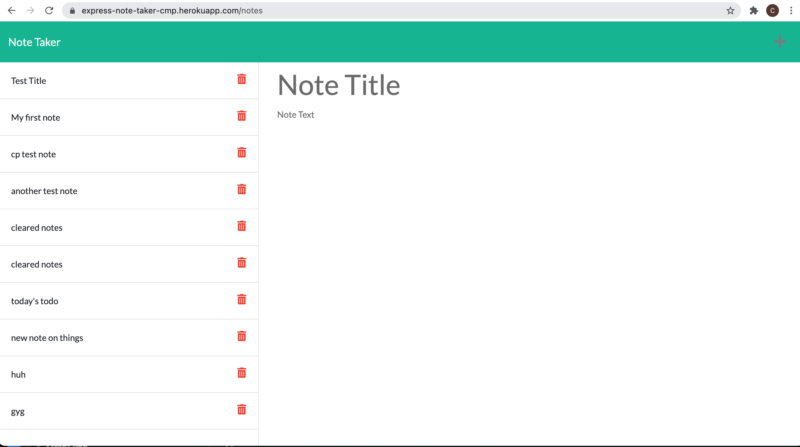

# express-note-taker

## Description ##

Brief description of application:

Link to deployed app: <https://express-note-taker-cmp.herokuapp.com/notes>

This application will produce an application that presents a user with a Note Taking application. The landing page links to a notes page where you can input a new note, save the note and view existing notes. 

It is written in node.js and includes the Express package to build a web server and handle API routing. 

The User Story: AS A small business owner

I WANT to be able to write and save notes

SO THAT I can organize my thoughts and keep track of tasks I need to complete.

Note: this application is covered by the  license

## Table of Contents ##

* [Installation](#installation)
* [Usage](#usage)
* [License](#license)
* [Contributing](#contributing)
* [Tests](#tests)¬¬
* [Questions](#questions)

- - -

## Installation ##
Below are brief instructions on how to install:

You will need node.js with the express and fs packages. You can download the basic javascript files to build the application from github, but they have dependencies on node.js and express. If you clone the repo, then you can simply run npm init -y in the terminal from the folder directory, and then install dependencies using npm install. 

## Usage ##
How to use this application: 

Once you have cloned the repo and set up node and the dependencies, deploy either to local machine or to a cloud service like heroku. The application link above is to heroku. 

## License ##
This application is covered by the following license: 

Creative Commons license family 4.0

## Contributing ##
This project was developed by Chris Pysden as part of the UW Bootcamp Certificate Course for Full Stack Developers. If you would like to contribute to improving this project, then you'd be very welcome. Please follow the following guidelines (which are loosely based on Atom project guidelines):

* send an email to me using the links below to request to be added to the project and improvements briefly describe the improvements you'd like to make
* always create a new branch that encapsulates your changes
* notifiy me before commiting any updates/changes
* track all bugs as issues in the project
* have fun

## Tests ##
Tests included are referenced below:

Test:  

I am working on implementing some basic tests to check validity of the input and to ensure consistency. Currently there are no tests that ship with the code.

## Questions ##

My Github profile is here: <https://github.com/cpysden-coder>

Please contact me with questions at <chris_pysden@mac.com>
